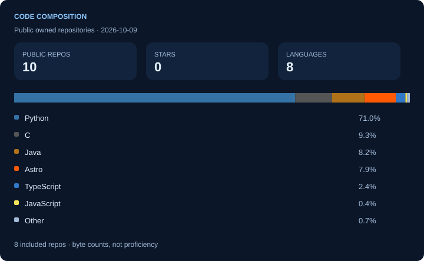

I build desktop applications, Telegram bots, Python libraries, and developer tools. My background spans software development, test automation, cybersecurity, and research. Useful software, experiments, and the occasional unnecessary tool all have a place here.

### The toolbox

**Languages**

       

**Frameworks**

  

**Databases**

 

**Tools**

       

### The numbers behind the code

Refreshed daily when GitHub Actions runs. Public data only; forks excluded from language, star, and commit aggregates. [Metric definitions & generator](scripts/README.md).

---

[Website](https://jburn.github.io/) · [LinkedIn](https://www.linkedin.com/in/juhobruun/) · [Browse repositories](https://github.com/jburn?tab=repositories)

Counter-service events, not unique visitors or lifetime GitHub profile views. GitHub image caching, bots, and repeated views affect the count. External dependency: [Komarev](https://github.com/antonkomarev/github-profile-views-counter).
